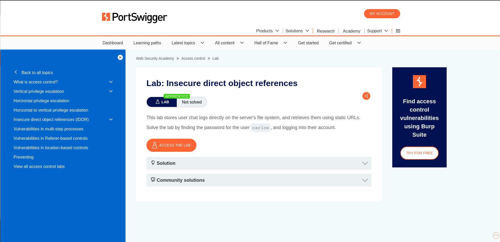
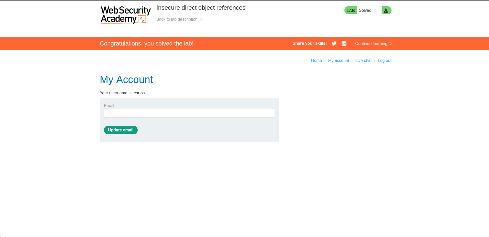

# Lab 04 - Insecure Direct Object References (IDOR)

## Lab Overview

This lab demonstrates an Insecure Direct Object Reference (IDOR) vulnerability where sensitive user data is exposed through predictable URL paths.

## Objective

Retrieve the password of another user and gain access to their account.

## Vulnerability Type

- Access Control
- Insecure Direct Object Reference (IDOR)

## Methodology

1. Analyzed the application's URL structure.
2. Identified predictable file locations used to store user chat logs.
3. Accessed another user's chat transcript directly.
4. Extracted credentials from the exposed log file.
5. Logged into the victim account.

## Impact

Attackers can access unauthorized user data by manipulating object references without proper authorization checks.

## Remediation

- Implement server-side authorization checks.
- Avoid exposing internal object identifiers.
- Use indirect reference maps and access validation.

## Screenshots

### Lab Description

### Lab Solved

## Skills Learned

- Access Control Testing
- IDOR Discovery
- Authorization Bypass
- Sensitive Data Exposure Analysis
