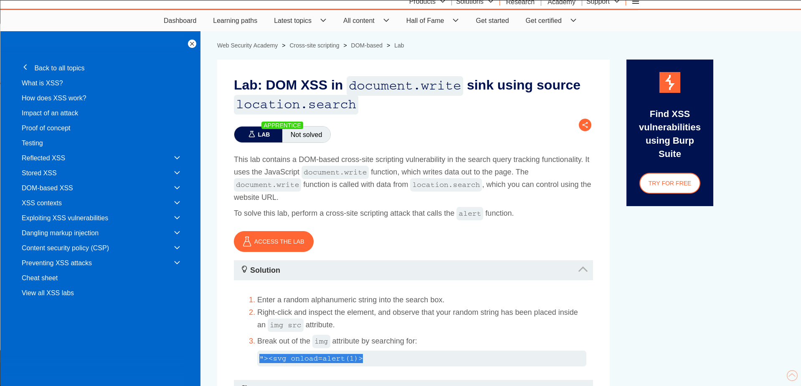
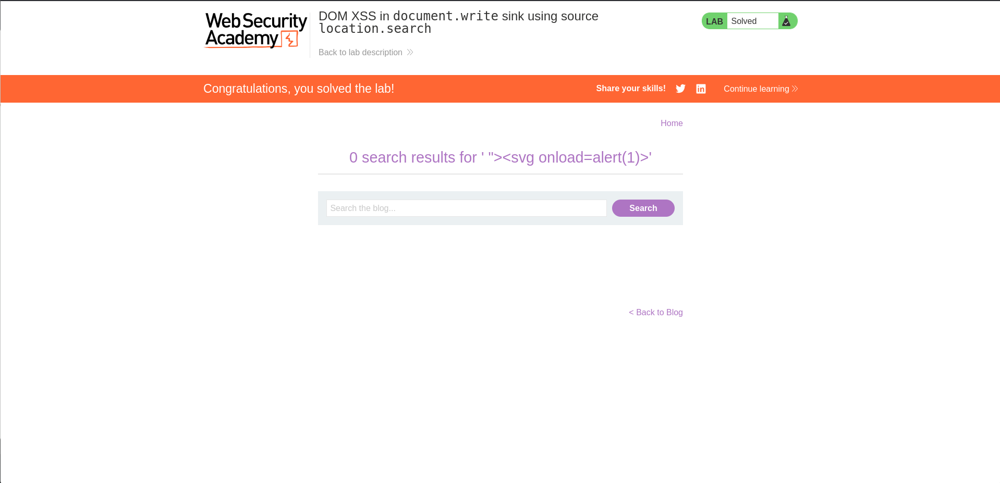

# Lab 01 - DOM XSS using document.write and location.search

## Lab Overview

This lab demonstrates a DOM-Based Cross-Site Scripting vulnerability caused by unsafe use of `document.write()`.

## Objective

Execute JavaScript by controlling data from the URL.

## Vulnerability Type

- DOM-Based XSS

## Methodology

1. Inspected client-side JavaScript.
2. Identified data flow from `location.search`.
3. Found unsafe sink using `document.write()`.
4. Injected a malicious payload.
5. Triggered JavaScript execution.

## Payload Used

```html
"><svg onload=alert(1)>
```

## Impact

DOM-based XSS enables attackers to execute arbitrary scripts in the victim's browser.

## Remediation

- Avoid document.write().
- Use safe DOM APIs.
- Encode user-controlled data.

## Screenshots

### Lab Description



### Lab Solved



## Skills Learned

- DOM Analysis
- Source and Sink Identification
- Client-Side Exploitation
- Secure JavaScript Development
