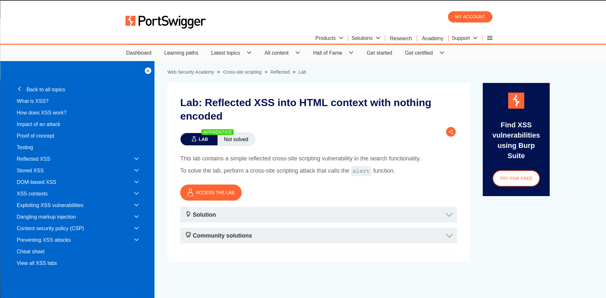
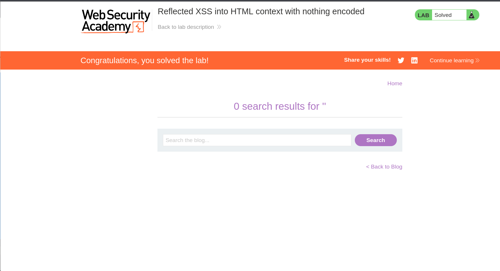

# Lab 01 - Reflected XSS into HTML Context

## Lab Overview

This lab contains a Reflected Cross-Site Scripting (XSS) vulnerability in a search functionality.

## Objective

Trigger JavaScript execution using the `alert()` function.

## Vulnerability Type

- Reflected XSS

## Methodology

1. Identified user input reflected in the response.
2. Injected JavaScript payload.
3. Verified execution within the browser.
4. Successfully solved the lab.

## Payload Used

```html
<script>alert(1)</script>
```

## Impact

Attackers can execute arbitrary JavaScript in a victim's browser.

## Remediation

- Context-aware output encoding.
- Input validation.
- Content Security Policy (CSP).

## Screenshots

### Lab Description



### Payload Execution



### Lab Solved


## Skills Learned

- Reflected XSS Discovery
- Payload Testing
- Browser Exploitation
- Secure Output Encoding
