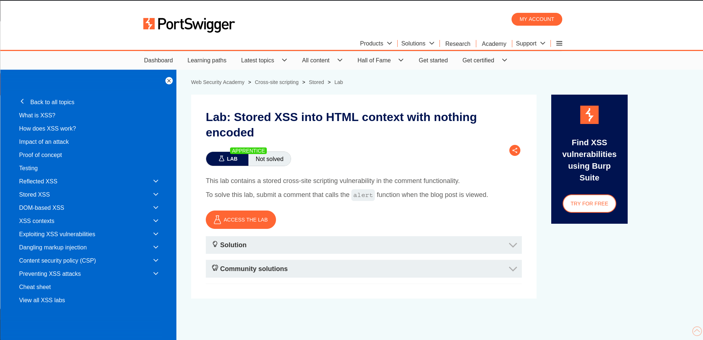
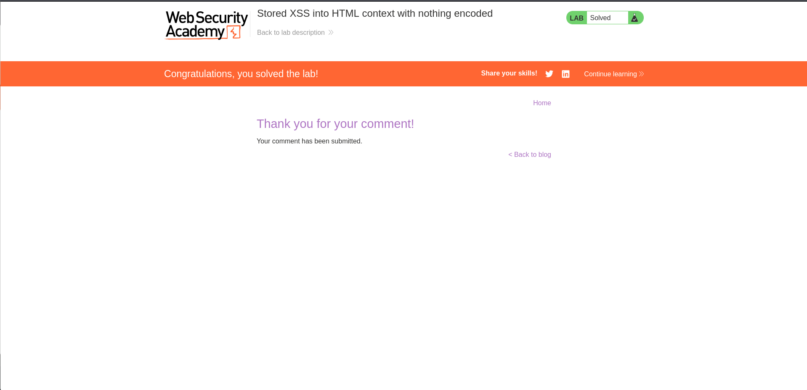

# Lab 01 - Stored XSS into HTML Context

## Lab Overview

This lab demonstrates a Stored Cross-Site Scripting vulnerability within the comment system.

## Objective

Store a malicious payload that executes when users view the page.

## Vulnerability Type

- Stored XSS

## Methodology

1. Located a comment submission form.
2. Injected a JavaScript payload.
3. Submitted the comment.
4. Triggered execution when the page was rendered.

## Payload Used

```html
<script>alert(1)</script>
```

## Impact

Stored XSS affects every user who visits the vulnerable page.

## Remediation

- Sanitize user-generated content.
- Apply output encoding.
- Implement Content Security Policy.

## Screenshots

### Lab Description



### Payload Submitted


### Lab Solved



## Skills Learned

- Stored XSS Testing
- Persistent Payload Injection
- Client-Side Attack Analysis
- Secure Content Handling
