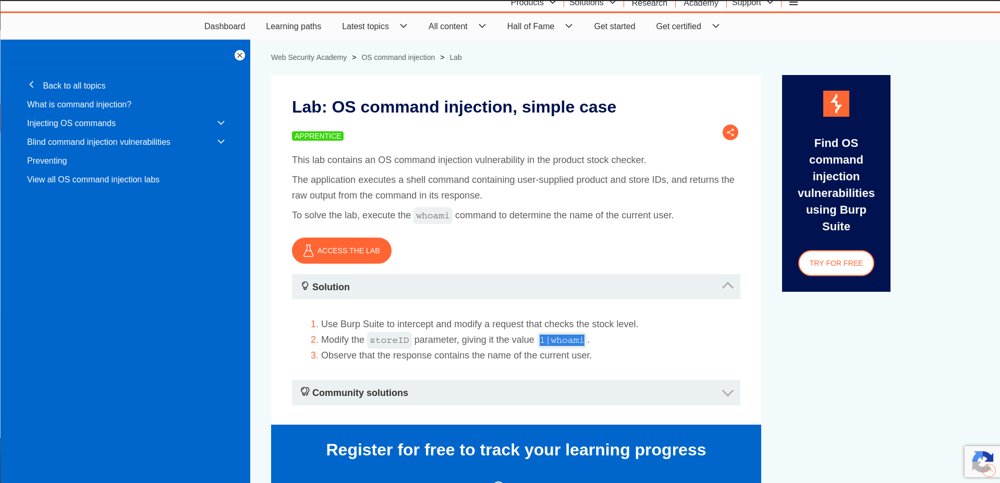
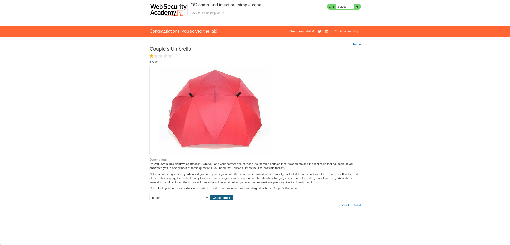

# Lab 01 - OS Command Injection (Simple Case)

## Lab Overview

This lab contains an OS Command Injection vulnerability in the stock checking functionality.

## Objective

Execute the `whoami` command on the underlying operating system.

## Vulnerability Type

- OS Command Injection
- Remote Command Execution

## Methodology

1. Identified user-controlled input in the stock checker.
2. Intercepted the request using Burp Suite.
3. Injected a command separator.
4. Appended the `whoami` command.
5. Verified command execution from the response.

## Payload Used

```bash
| whoami
```

## Impact

Successful exploitation may lead to arbitrary command execution on the server.

## Remediation

- Avoid shell execution where possible.
- Use parameterized APIs.
- Validate and sanitize user input.
- Implement allowlists.

## Screenshots

### Lab Description



### Lab Solved



## Skills Learned

- Command Injection Testing
- Burp Suite Interception
- Payload Crafting
- Input Validation Analysis
