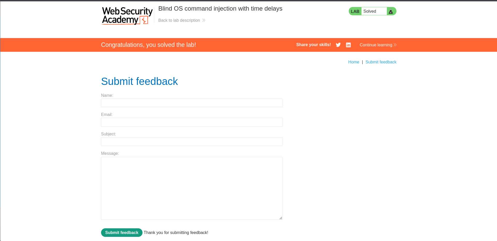
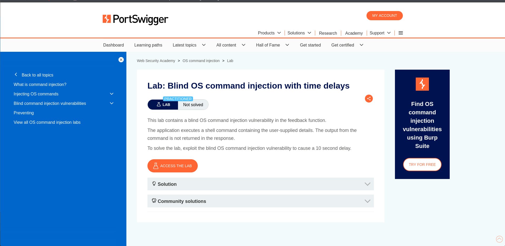

# Lab 02 - Blind OS Command Injection with Time Delays

## Lab Overview

This lab demonstrates Blind OS Command Injection where command output is not visible to the attacker.

## Objective

Trigger a 10-second delay to confirm command execution.

## Vulnerability Type

- Blind OS Command Injection

## Methodology

1. Located a feedback submission form.
2. Intercepted the request using Burp Suite.
3. Injected a time-delay command.
4. Observed delayed server response.
5. Confirmed successful command execution.

## Payload Used

```bash
|| ping -c 10 127.0.0.1 ||
```

## Impact

Blind command injection can lead to full server compromise even without visible output.

## Remediation

- Never execute user input directly.
- Use secure APIs instead of shell commands.
- Implement strict server-side validation.

## Screenshots

### Lab Description



### Lab Solved



## Skills Learned

- Blind Injection Detection
- Time-Based Validation
- Burp Suite Testing
- Command Execution Verification
